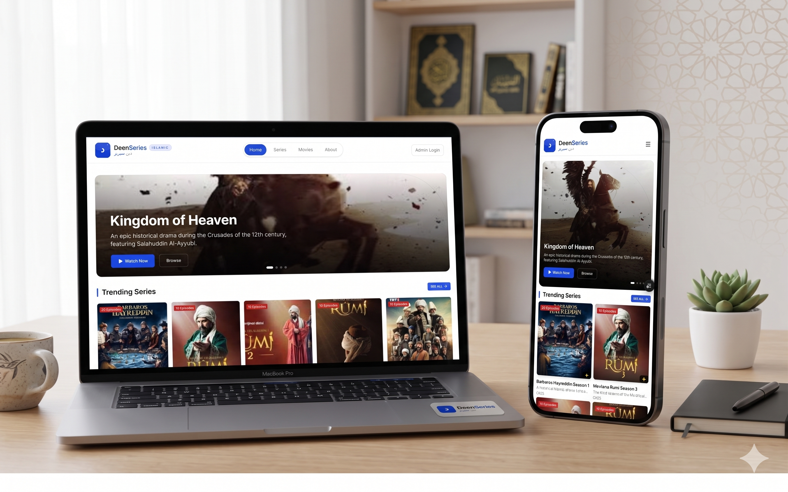
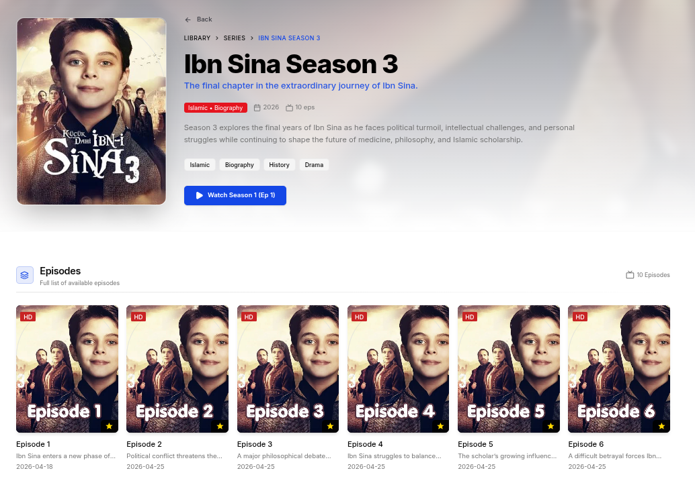
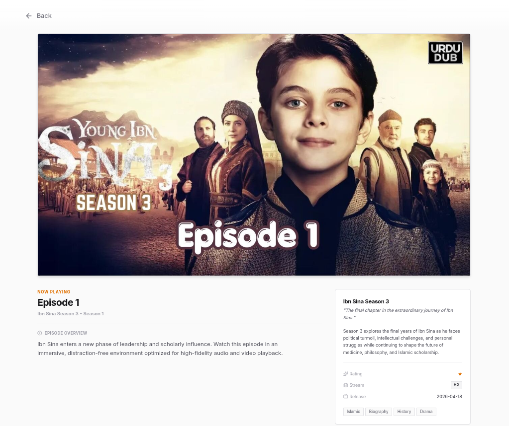

# DeenSeries

A modern full-stack streaming platform for Islamic movies and series built with Next.js, NestJS, MongoDB, and TypeScript.

## Live Demo

https://deenseries.vercel.app

## Screenshots

### Responsive Mockup



### Series Listing



### Video Player



---

## Features

### Public Features

* Browse Islamic Movies & Series
* Episode-Based Streaming
* Responsive Design (Mobile & Desktop)
* Dynamic SEO Metadata
* XML Sitemap & Robots.txt
* Optimized Image Loading
* Fast Navigation with App Router

### Admin Features

* Secure JWT Authentication
* Movies Management
* Series Management
* Episode Management
* Cloudinary Image Upload
* Cloudinary Image Deletion
* Publish / Unpublish Content
* Reusable Admin Forms

---

## Tech Stack

### Frontend

* Next.js 15 (App Router)
* TypeScript
* Redux Toolkit
* RTK Query
* Tailwind CSS

### Backend

* NestJS
* MongoDB
* Mongoose
* JWT Authentication
* Cookie-Based Authentication

### Media

* Cloudinary

### Deployment

* Vercel

---

## Project Structure

```bash
client/
server/
```

### Frontend

```bash
client/src
├── app
├── components
├── hooks
├── lib
├── store
└── types
```

### Backend

```bash
server/src
├── modules
├── database
├── seeds
└── common
```

---

## Installation

### Clone Repository

```bash
git clone https://github.com/your-username/deenseries.git
cd deenseries
```

### Frontend

```bash
cd client

npm install

npm run dev
```

### Backend

```bash
cd server

npm install

npm run start:dev
```

---

## Environment Variables

### Frontend

```env
NEXT_PUBLIC_SITE_URL=
NEXT_PUBLIC_SITE_NAME=

NEXT_PUBLIC_API_PROXY=

BACKEND_API_URL=
```

### Backend

```env
PORT=

MONGODB_URI=

JWT_ACCESS_SECRET=
JWT_REFRESH_SECRET=

JWT_ACCESS_EXPIRES_IN=
JWT_REFRESH_EXPIRES_IN=

ADMIN_PASSWORD_HASH=

CLOUDINARY_CLOUD_NAME=
CLOUDINARY_API_KEY=
CLOUDINARY_API_SECRET=
```

---

## SEO

* Dynamic Metadata
* Open Graph Support
* XML Sitemap
* Robots.txt
* Search Engine Friendly URLs

---

## Future Improvements

* Search System
* Watch History
* User Accounts
* Favorites / Bookmarks
* Multi-Language Support
* Analytics Dashboard

---

## Author

**Tarikul Islam**

Full Stack Developer specializing in Next.js, NestJS, TypeScript, and MongoDB.

### Connect With Me

* Portfolio: https://tarikul.vercel.app
* LinkedIn: https://www.linkedin.com/in/tarikul-islam
* GitHub: https://github.com/tarikul3639

---

If you found this project helpful, please consider giving it a ⭐ on GitHub.

